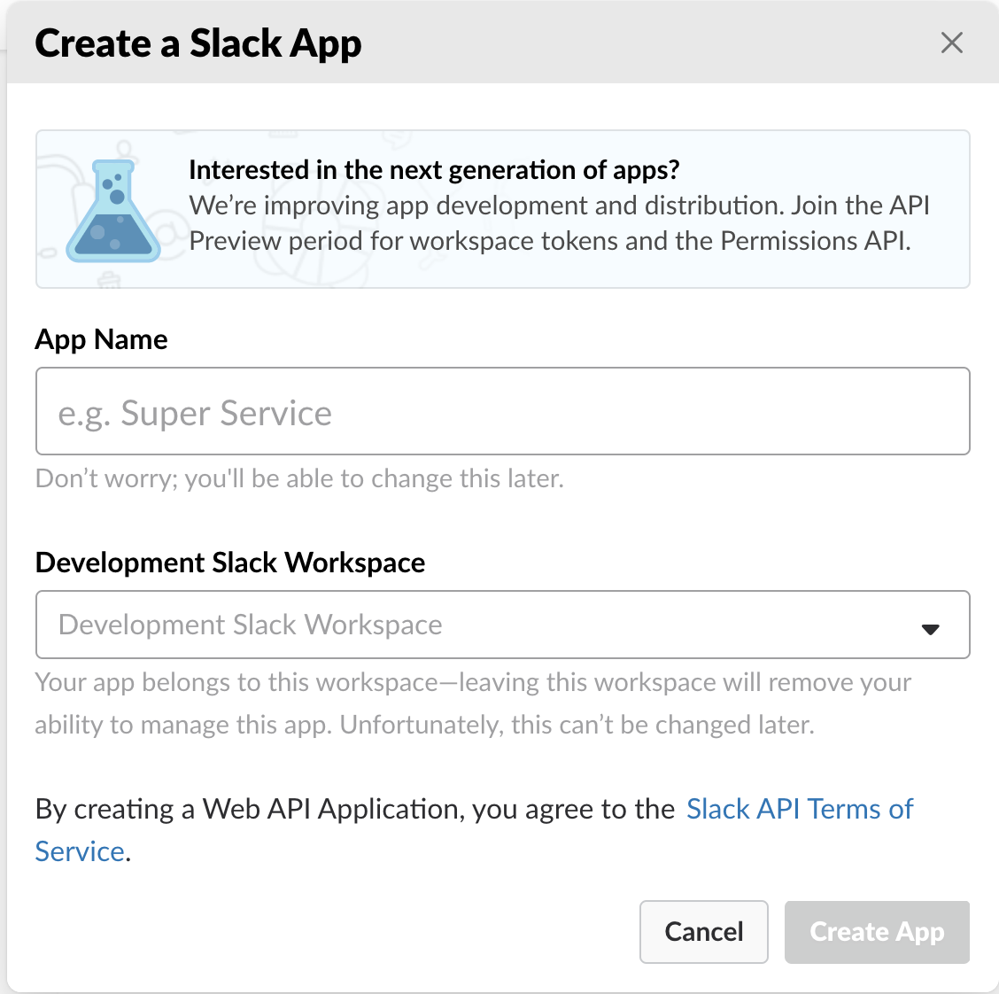
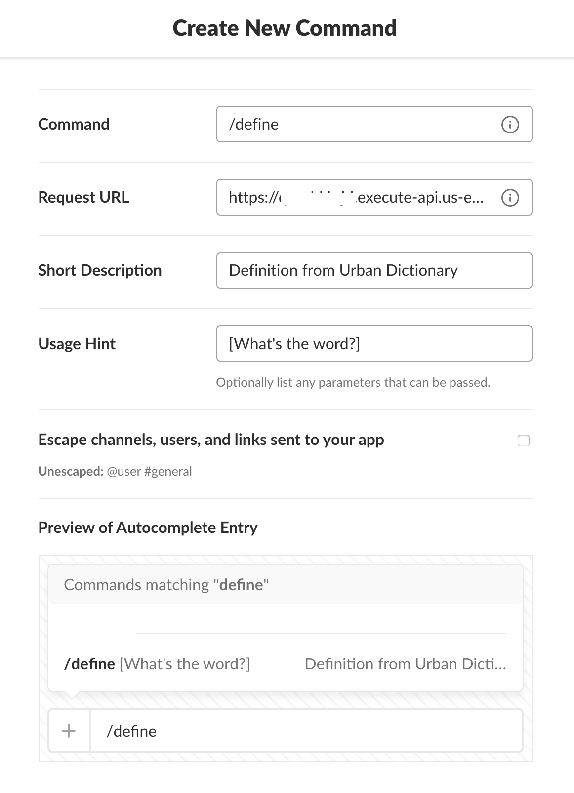
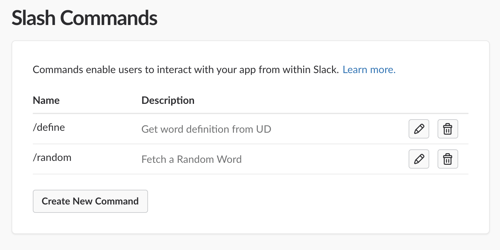

# Serverless Slack Slash Commands

The repo leverages serverless and demonstrates how to create/integrate serverless with Slack. In this one we are leveraging Urban Dictonary APIs to get definition of a word or get a random word and integrating them into Slack Slash Commands.

## PreRequisites
- You need an AWS account and credentials setup locally. Read more about that at https://github.com/serverless/serverless/blob/master/docs/providers/aws/guide/credentials.md
- You need to have serverless installed npm install serverless -g

## Build and Compile code
This uses the github.com/eawsy/aws-lambda-go-net framework to generates the .so file and the handler.zip which can be leveraged by the serverless template

```
make
```

## Deploy the APIs to the Gateway
The APIs for `/define` and `/random` are part of the handler.go and defined in `serverless.yml`. You can deploy them via serverless as below.
```
serverless deploy -v -stage="dev"
```

Once the deployment is completed, you will get the slack endpoint in the service information output. 

## Setting up Slack for Slash Commands

### Create App
The first step is to create a Slack app, allowing you to register commands, among other things



### Setup Slash Commands

Once created, click "Slash commands" in the menu on the left, and register the `/define` command. You need to paste the slack service command URL from serverless output in the request URL textbox.



Repeat the step to create the `/random` slash command

Once done, all your commands will look like below




## All Set
Now you can integrate the app in your slack channel and execute `/define man flu` or `/random` to interact with Urban Dictionary
